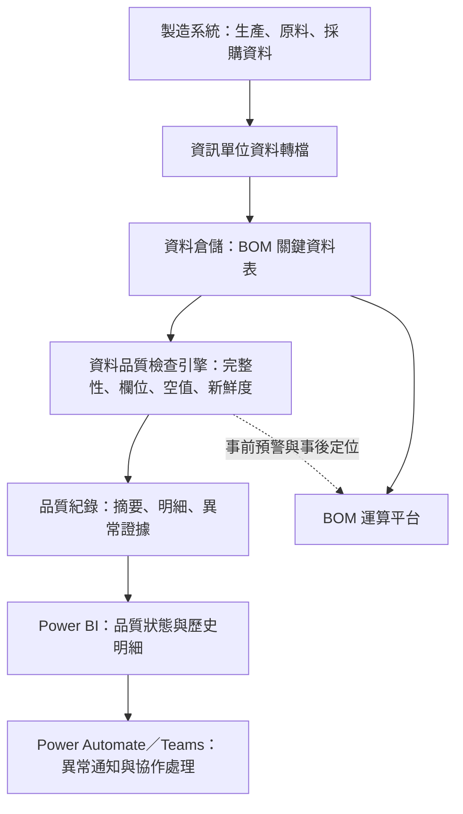

# 製造資料品質監控平台

> 在 BOM 執行前檢查關鍵資料是否完整、準時更新，將資料異常從「結果出錯後才發現」提前為可監控、可定位、可通知的品質管理流程。

## 專案摘要

BOM 運算需要整合多張製造、原料及採購資料表。早期資料由資訊單位從製造系統轉檔至資料倉儲，但轉檔流程偶爾會發生空表、未更新或欄位異常。當時通常要等到 BOM 結果明顯不合理，才會回頭逐張檢查資料來源，不但發現時間晚，也很難快速定位問題。

為降低錯誤資料進入 BOM 的風險，我建立資料品質監控平台，針對 BOM 使用的 **8 張關鍵資料表**執行每日檢查，確認資料表不為空、必要欄位存在、欄位值不為空，以及資料是否在預期時間內完成更新。檢查結果寫入品質紀錄，透過 Power BI 集中呈現，並由 Power Automate 將異常通知推送至 Teams，讓我與運籌、煉鋼等相關單位能及早處理。

系統於 **2025 年 7 月上線**，曾成功發現資料表全空的異常，並透過 Teams 通知相關單位排除。隨著 BOM 資料來源逐步改為直接讀取製造系統源頭，原有轉檔風險下降，此監控平台也將逐步退場。

## 專案資訊

| 項目 | 說明 |
|---|---|
| 業務領域 | 製造資料品質、BOM 穩定性、資料治理 |
| 專案角色 | 需求定義、品質規則設計、程式開發、儀表板與通知流程 |
| 主要使用者 | 本人；異常時同步知會運籌、煉鋼等相關單位 |
| 監控範圍 | 每日檢查 8 張 BOM 關鍵資料表 |
| 上線時間 | 2025 年 7 月 |
| 目前狀態 | 配合資料來源改為直接讀取源頭，逐步下線 |

## 業務問題

### 原有資料流程

1. 製造系統產生生產、原料與採購相關資料。
2. 資訊單位負責將資料轉檔至資料倉儲。
3. BOM 系統從資料倉儲讀取多張資料表進行運算。
4. 若其中一張表未更新或內容異常，通常要等 BOM 結果出現異常才會被發現。

### 主要痛點

- **發現時間晚**：資料問題通常在下游 BOM 結果不合理後才浮現。
- **定位速度慢**：需要逐張檢查多個資料來源，才能確認是哪一張表發生問題。
- **轉檔狀態不可見**：業務使用者無法直接掌握各資料表是否已完成當日更新。
- **跨單位溝通缺少證據**：異常發生時，缺少一致的檢查結果與時間紀錄供資訊及業務單位確認。

## 我的角色與責任

- 盤點 BOM 運算所依賴的關鍵資料表與預期更新時間。
- 定義空表、必要欄位、空值及資料新鮮度等品質規則。
- 使用設定檔管理資料來源、排程時段、資料表及對應檢查規則。
- 開發自動化品質檢查程式，產出資料表層級與規則層級結果。
- 建立摘要與明細紀錄，保存執行時間、資料來源、檢查項目及異常細節。
- 使用 Power BI 建立資料品質監控儀表板。
- 串接 Power Automate 與 Teams，將異常主動通知相關單位。
- 在資料異常時協助定位問題資料表，並與資訊及業務單位協作排除。

> 原始資料轉檔流程由資訊單位負責；本專案的核心貢獻是建立獨立的監控與證據層，讓轉檔問題能在影響 BOM 前被發現，或在事後快速定位。

## 系統架構

下圖使用去識別化名稱呈現資料流與監控關係。

詳細說明請見 [系統架構圖](docs/architecture.md)。

## 資料品質規則

| 品質面向 | 檢查內容 | 可發現的問題 |
|---|---|---|
| 資料完整性 | 資料表筆數至少大於零 | 轉檔失敗造成整張表為空 |
| 結構完整性 | 必要的資料日期欄位必須存在 | 欄位刪除、改名或結構異動 |
| 欄位完整性 | 更新日期欄位不得為空 | 部分資料缺少轉檔時間或來源日期 |
| 資料新鮮度 | 最新資料日期必須落在預期時間範圍 | 當日未更新、排程延遲或轉檔中斷 |

品質規則以設定檔管理，可依不同資料表組合檢查項目，不需要將所有規則寫死在程式中。

## 監控流程

1. **依時段選取監控範圍**：系統根據排程設定，取得當下應檢查的資料表。
2. **載入品質規則**：依資料表讀取對應的規則設定。
3. **執行資料檢查**：連線資料倉儲，檢查表格筆數、欄位、空值與最新資料時間。
4. **保存摘要結果**：記錄資料表、執行時間、正常或警告狀態及批次識別碼。
5. **保存規則明細**：記錄每項檢查是否通過、異常筆數與實際觀察值。
6. **更新儀表板**：在 Power BI 呈現各資料表狀態及歷史檢查明細。
7. **推送異常通知**：透過 Power Automate 將異常送至 Teams，通知相關單位處理。

## 儀表板設計

監控儀表板分成兩個閱讀層次：

### 摘要層

- 執行時間
- 監控事件
- 資料表或作業項目
- 正常／警告狀態
- 簡要說明

摘要層讓使用者先判斷「今天哪些資料有問題」。

### 明細層

- 資料來源與資料表
- 檢查規則名稱
- 欄位名稱
- 通過／失敗結果
- 異常筆數或實際觀察值
- 執行批次及時間

明細層協助使用者回答「哪一項規則失敗、實際資料狀態是什麼」。

## 實際異常案例

系統上線後曾檢查到 BOM 使用的關鍵資料表全空：

1. 品質檢查將資料表標記為異常。
2. 儀表板顯示失敗資料表與檢查項目。
3. 異常資訊透過 Teams 通知相關單位。
4. 團隊依明確的資料表與時間資訊，確認轉檔問題並進行排除。

這個案例證明平台能在 BOM 使用錯誤資料前提供預警；即使異常已影響運算，也能縮短逐張排查資料表的時間。

## 關鍵設計

### 1. 將品質檢查放在 BOM 上游

與其只在 BOM 結果異常後分析原因，系統直接監控模型依賴的來源表，將問題定位往上游移動。

### 2. 摘要與明細分層保存

摘要紀錄適合儀表板與通知；規則明細則保留欄位、異常筆數及實際觀察值，支援後續追查。

### 3. 規則與程式分離

資料來源、排程、資料表與檢查規則以設定檔管理，方便增減監控範圍及調整預期更新時間。

### 4. 監控結果進入協作流程

品質檢查不只產生技術紀錄，也透過 Power BI 與 Teams 轉化為業務及資訊單位可以理解和處理的訊息。

## 專案成果

- 將資料異常從「BOM 結果出錯後才發現」提前至上游資料檢查階段。
- 每日監控 **8 張 BOM 關鍵資料表**的完整性與更新狀態。
- 建立資料表及規則兩個層級的品質紀錄，提高異常可追溯性。
- 透過 Power BI 與 Teams，讓異常狀態可以被看見、通知及協作處理。
- 曾成功發現資料表全空問題，並通知相關單位排除。
- 為 BOM 穩定運作提供過渡期控制，降低上游轉檔不穩定造成的風險。
- 監控經驗也支持後續架構改善：逐步改為直接讀取製造系統源頭，從根本降低轉檔風險。

## 挑戰與解法

| 挑戰 | 解法 |
|---|---|
| 轉檔問題不一定直接報錯，可能只呈現空表或舊資料 | 同時檢查表格筆數、必要欄位及最新資料時間 |
| 多張資料表更新時間與欄位不完全相同 | 以設定檔分別管理排程、資料來源與規則組合 |
| BOM 異常時難以快速定位上游問題 | 保存資料表及規則明細，讓使用者直接找到失敗項目 |
| 品質結果若只有技術人員看得到，仍無法快速協作 | 以 Power BI 呈現狀態，並透過 Teams 通知相關單位 |
| 監控只能降低風險，無法消除轉檔依賴 | 推動 BOM 改為直接讀取源頭資料，使監控平台可以逐步退場 |

## 使用技術

| 技術 | 用途 |
|---|---|
| Python | 排程判斷、品質檢查、結果整理與紀錄寫入 |
| Great Expectations | 建立資料表、欄位、空值及資料新鮮度規則 |
| YAML | 管理資料來源、監控時段、資料表與規則組合 |
| SQL／關聯式資料庫 | 讀取被監控資料並保存摘要及明細結果 |
| Power BI | 顯示品質狀態、異常項目及歷史紀錄 |
| Power Automate | 串接儀表板結果與通知流程 |
| Teams | 異常通報與跨部門協作處理 |

## 專案生命週期與退出策略

本平台的目的，是在資料倉儲轉檔品質尚未完全穩定時，為 BOM 建立一層可觀測的風險控制。它並不是取代源頭資料治理，也不是預期永久保留的架構。

隨著 BOM 的主要資料來源改為直接讀取製造系統資料表，轉檔延遲、空表及中間層異常的風險已大幅降低。因此，平台將逐步下線，僅在仍依賴轉檔的資料來源上保留必要監控。

對我而言，這個專案的價值不只在於建立一套檢查程式，也在於辨識控制措施的適用期間，並在上游架構改善後適時簡化系統。

## 資料與保密說明

本案例依實際專案重新整理，僅呈現問題、品質管理方法與去識別化架構。公開內容未包含任職公司的原始資料、帳號、密碼、內部網址、實際資料表名稱、連線資訊、完整程式碼及業務敏感欄位。

