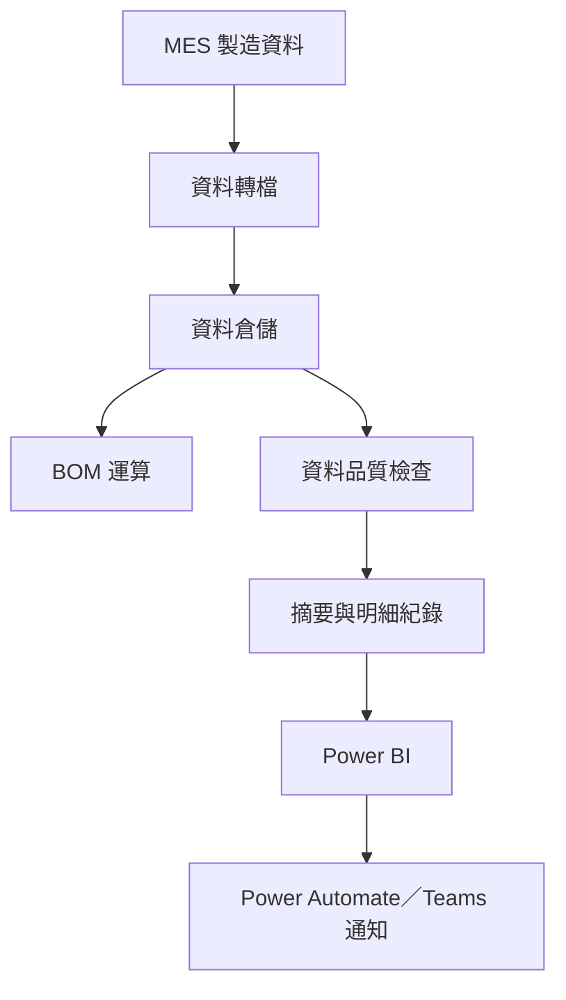

# 製造資料品質監控平台

每日檢查 BOM 使用的關鍵資料表，在運算前辨識空表、欄位缺漏及更新延遲。

## 專案概況

| 項目 | 說明 |
|---|---|
| 業務範圍 | 製造資料品質、BOM 穩定性 |
| 個人職責 | 規則設計、程式開發、儀表板、通知流程 |
| 監控範圍 | 8 張 BOM 關鍵資料表，每日檢查 |
| 上線時間 | 2025 年 7 月 |
| 目前狀態 | 資料改接 MES 後逐步下線 |

## 問題

BOM 原先從資料倉儲讀取製造資料；資料由資訊單位自 MES 轉檔。轉檔偶有空表、欄位異常或更新延遲，通常要等 BOM 結果不合理後才發現，再逐張排查來源表，處理時間較長。

## 作法

1. 盤點 BOM 使用的 8 張關鍵資料表及預期更新時間。
2. 設定空表、必要欄位、空值及資料新鮮度規則。
3. 每日執行檢查，保存資料表及規則明細。
4. 以 Power BI 顯示狀態與歷史紀錄。
5. 異常時由 Power Automate 推送至 Teams，通知運籌、煉鋼及相關單位。

## 檢查規則

| 項目 | 檢查內容 |
|---|---|
| 完整性 | 資料表筆數大於零 |
| 結構 | 必要欄位存在 |
| 欄位品質 | 指定欄位不得為空 |
| 新鮮度 | 最新資料落在預期期間 |

資料來源、排程、資料表與規則均以設定檔管理，便於調整監控範圍。

## 系統架構

詳細資料流及退場規劃請見 [系統架構](docs/architecture.md)。

## 個人貢獻

- 定義監控範圍、更新時點及品質規則。
- 開發自動檢查程式與設定檔管理方式。
- 建立摘要及明細紀錄，保留批次、時間與異常內容。
- 建置 Power BI 儀表板及 Teams 通知流程。
- 協助資訊與業務單位定位並排除異常。

資料轉檔由資訊單位負責；本專案提供獨立監控及異常證據。

## 實際案例

系統曾在 BOM 運算前發現關鍵資料表全空，隨即透過 Teams 通知相關單位。明確的資料表、檢查規則與時間紀錄，協助團隊快速確認轉檔問題並完成排除。

## 成果

- 將異常發現時點由 BOM 運算後提前至資料輸入前。
- 每日監控 **8 張關鍵資料表**的完整性及更新狀態。
- 建立 Power BI 監控及 Teams 主動通知流程。
- 留存規則明細，縮短異常定位時間。
- 曾於運算前發現空表並協助排除。

## 退場規劃

本平台用於控管 MES 至資料倉儲的轉檔風險。BOM 改為直接讀取 MES 後，中間轉檔風險隨之降低，因此僅保留仍有需要的監控項目，並逐步停止其餘功能。

## 使用技術

Python、Great Expectations、YAML、SQL、關聯式資料庫、Power BI、Power Automate、Teams。

## 保密說明

本案例僅呈現去識別化的問題、品質規則與系統架構，不含公司原始資料、帳密、內部網址、實際資料表名稱、連線資訊及完整程式碼。
