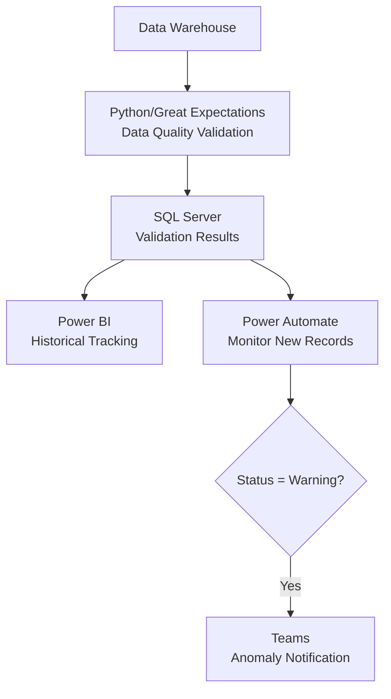

**English** | [繁體中文](README_ZH-TW.md)

# Data Quality Monitoring Platform

The Data Warehouse supplies the data required by both the [Lowest-Cost BOM Data and Decision Platform](https://github.com/ChienChienChien/BOM_Management_Platform/blob/main/README.md) and the [Material Inventory Forecasting and Alert System](https://github.com/ChienChienChien/Material_Forecasting_System/blob/master/README.md), establishing reliable data-quality before the data enters decision-making processes.

## Purpose

The Data Warehouse receives data from enterprise systems such as MES and SAP. During data transfer, the following issues may cause delays, missing data, or incomplete records:

- Performance issues in enterprise systems or the data warehouse
- Database locks or poor query performance
- Changes to source table schemas
- Data transfer process failures

This project takes a monitoring-focused approach, using daily automated checks, centralized monitoring, and exception notifications to identify data issues before they affect downstream analytics and decision-making, improving the reliability of decision data.

## Outcomes and Approach

### 1. Define Data Expectations

| Validation Dimension | Validation Rule | Management Objective |
|---|---|---|
| Freshness | Whether each table completes its daily update by the expected time | Prevent downstream systems from using stale data |
| Completeness | Whether a table is empty | Detect missing data or incomplete transfers |
| Basic schema | Whether required columns are present | Early detection of workflow risks caused by source-schema Changes |

### 2. Data Validation Automation

The validation program is deployed on a Windows Server and automatically triggered by Windows Task Scheduler at 8:00 a.m. each day. Python uses Great Expectations to perform data-quality checks, writing both overall results and rule-level details to SQL Server for Power BI to refresh the monitoring dashboard.

Through automated validation and centralized reporting, data quality management no longer depends on manual table-by-table checks. Maintainers can use historical records to quickly identify the affected table, incident time, and failed rules, shortening the time required to confirm and locate issues.

### 3. From User-Reported Issues to Proactive Exception Notifications

When SQL Server records a new validation result with a Warning status, Power Automate automatically posts an alert to Teams, enabling report users and maintainers to identify the issue early.

After receiving an exception notification, Maintainers can review the validation details in the Power BI Data Exception Monitoring table (shown below), confirm the issue, and then contact IT or the relevant system owners for resolution.

<table>
  <tr>
    <td align="center" width="100%">
        
    </td>
  </tr>
</table>

> Warning example: The upper section shows anomaly history, while the lower section retains the rule results and details for an individual validation run, helping maintainers quickly identify the source of the issue.

## Architecture

```mermaid
flowchart TB
    A["Data Warehouse"] --> C["Python/Great Expectations<br/>Data Quality Validation"]
    C --> D["SQL Server<br/>Validation Results"]
    D --> E["Power BI<br/>Historical Tracking"]
    D --> F["Power Automate<br/>Monitor New Records"]
    F --> G{"Status = Warning?"}
    G -->|Yes| H["Teams<br/>Anomaly Notification"]
```

## Technology

| Category | Technology | Purpose |
|---|---|---|
| Validation | Python, Great Expectations | Execute freshness, completeness, and basic schema rules |
| Data storage | SQL Server | Store validation summaries, rule-level details, and historical records |
| Visualization | Power BI | Centralize anomaly statuses and validation results |
| Workflow and notifications | Power Automate, Microsoft Teams | Trigger and publish anomaly notifications based on `Warning` records |
| Runtime environment | Windows Server, Windows Task Scheduler | Run the validation workflow automatically each day |
