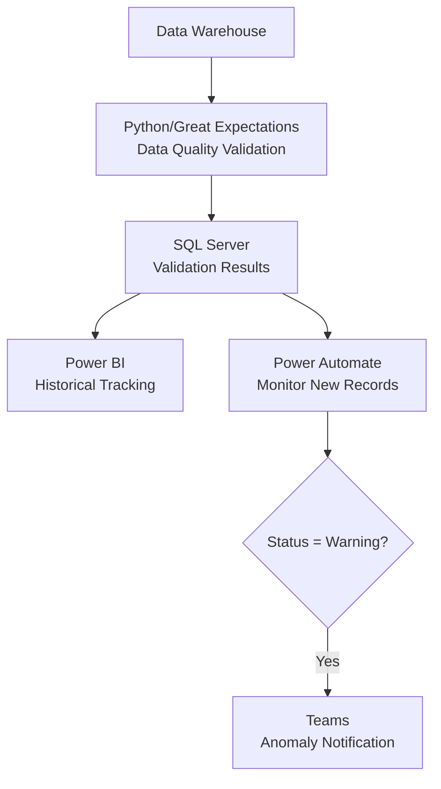

**English** | [繁體中文](README_ZH-TW.md)

# Data Quality Monitoring Platform

This project establishes an automated data quality monitoring and alerting mechanism that checks data freshness, completeness, and schema integrity before data from the data warehouse reaches downstream reports, analytical models, and decision-making workflows.

In this implementation, the platform monitors data warehouse inputs used by the [Lowest-Cost BOM Data and Decision Platform](https://github.com/ChienChienChien/BOM_Management_Platform/blob/main/README.md) and the [Material Inventory Forecasting and Alert System](https://github.com/ChienChienChien/Material_Forecasting_System/blob/master/README.md), reducing the risk of stale or incomplete data affecting operational decisions.

The rule-based approach can also be extended to other data sources and analytical workflows.

## Purpose

The data warehouse receives data from enterprise systems such as MES and SAP. During data transfer, the following issues may cause delays, missing data, or incomplete records:

- Performance issues in enterprise systems or the data warehouse
- Database locks or poor query performance
- Changes to source table schemas
- Data transfer process failures

This project uses daily automated validation, centralized monitoring, and anomaly alerts to identify data issues before they affect downstream analytics and decision-making, improving confidence in the data used for operational decisions.

## Outcomes and Approach

### 1. Establish a Baseline for Data Reliability

| Validation Dimension | Validation Rule | Management Objective |
|---|---|---|
| Freshness | Whether each table completes its daily update by the expected time | Prevent downstream systems from using stale data |
| Completeness | Whether a table is empty | Detect missing data or incomplete transfers |
| Basic schema | Whether required columns are present | Early detection of workflow risks caused by source-schema Changes |

### 2. Automate Daily Data Validation

The validation program is deployed on a Windows Server and automatically triggered by Windows Task Scheduler at 8:00 a.m. each day. Python uses Great Expectations to perform data-quality checks, writing both overall results and rule-level details to SQL Server for Power BI to refresh the monitoring dashboard.

Through automated validation and centralized reporting, data quality management no longer depends on manual table-by-table checks. Maintainers can use historical records to quickly identify the affected table, incident time, and failed rules, shortening the time required to confirm and locate issues.

### 3. Shift from User-Reported Issues to Proactive Alerts

When a new validation record is added to SQL Server, Power Automate checks its status and posts an alert to Teams if the result is `Warning`, allowing report users and maintainers to respond earlier.

After receiving an alert, maintainers can review the validation details in the Power BI data quality monitoring view (shown below), identify the affected table and failed rule, and contact IT or the relevant system owner for further investigation.

<table>
  <tr>
    <td align="center" width="100%">
        
    </td>
  </tr>
</table>

> Warning example: The upper section shows anomaly history, while the lower section provides rule-level results for a single validation run, helping maintainers quickly identify the affected table and failed rule.

## Architecture

```mermaid
flowchart TB
    A["Data Warehouse"] --> C["Python/Great Expectations<br/>Data Quality Validation"]
    C --> D["SQL Server<br/>Validation Results"]
    D --> E["Power BI<br/>Historical Tracking"]
    D --> F["Power Automate<br/>Monitor New Records"]
    F --> G{"Status = Warning?"}
    G -->|Yes| H["Teams<br/>Anomaly Notification"]
```

## Technology

| Category | Technology | Purpose |
|---|---|---|
| Validation | Python, Great Expectations | Execute freshness, completeness, and basic schema rules |
| Data storage | SQL Server | Store validation summaries, rule-level details, and historical records |
| Visualization | Power BI | Centralize anomaly statuses and validation results |
| Workflow and notifications | Power Automate, Microsoft Teams | Trigger and publish anomaly notifications based on `Warning` records |
| Runtime environment | Windows Server, Windows Task Scheduler | Run the validation workflow automatically each day |
