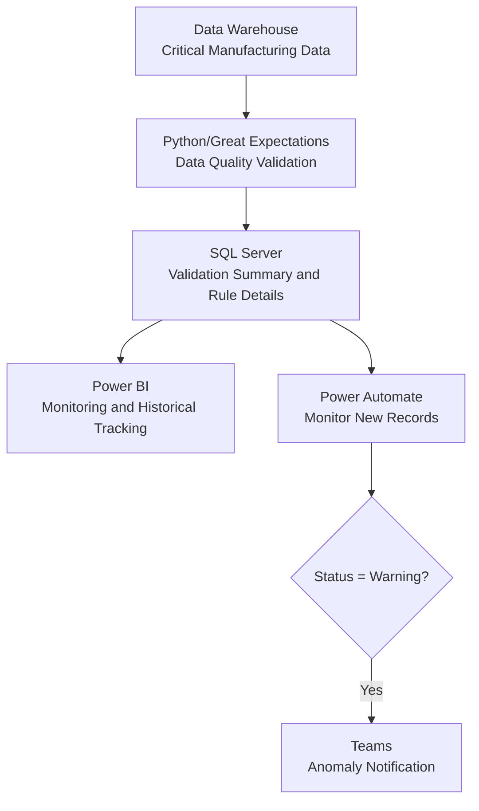

**English** | [繁體中文](README_ZH-TW.md)

# Data Quality Monitoring Platform

The data warehouse provides the data required by the [Least-Cost BOM Data and Decision Platform](https://github.com/ChienChienChien/BOM_Management_Platform/blob/main/README.md) and the [Material Inventory Forecasting and Alert System](https://github.com/ChienChienChien/Material_Forecasting_System/blob/master/README.md). This project establishes a reliable data quality gate before the data enters downstream decision-making workflows.

## Purpose

The data warehouse receives data from large-scale enterprise systems, such as MES and SAP, on a daily basis. During data transfer, the following issues may cause delays, missing data, or incomplete records:

- Performance issues in source systems or the data warehouse
- Database locks or poor query performance
- Changes to source table schemas
- Data transfer failures

From a monitoring perspective, this project combines automated daily validation, centralized monitoring, and anomaly notifications so that stale, missing, or structurally inconsistent data can be detected before it affects downstream analytics, improving the trustworthiness of decision-making data.

## Outcomes and Approach

### 1. Established a Quality Gate for Decision-Critical Data

For critical data used by the least-cost BOM process and material inventory forecasting, the platform applies three categories of validation rules—freshness, completeness, and basic schema—to confirm that the data meets baseline usability requirements before entering decision-making workflows.

| Validation Dimension | Validation Rule | Management Objective |
|---|---|---|
| Freshness | Whether each table completes its daily update by the expected time | Prevent downstream systems from using stale data |
| Completeness | Whether a table is empty or contains null values in the data transfer date | Detect missing data or incomplete transfers |
| Basic schema | Whether required columns are present | Identify risks caused by source schema changes before they disrupt downstream processes |

The mechanism focuses on data freshness, completeness, and basic schema as the first quality check before downstream models run, reducing the risk that anomalous data affects least-cost BOM calculations, inventory forecasts, and material shortage assessments.

### 2. Turned Data Validation into a Daily Automated Workflow

The validation program is deployed on Windows Server and triggered automatically by Windows Task Scheduler every day at 8:00 a.m. Python uses Great Expectations to execute data quality checks, writes the overall results and rule-level details to SQL Server, and makes them available for Power BI monitoring updates.

Through automated validation and centralized reporting, data quality management no longer depends on manual table-by-table checks. Maintainers can use historical records to quickly identify the affected table, incident time, and failed rules, shortening the time required to confirm and locate issues.

### 3. Shifted from User-Reported Issues to Proactive Anomaly Notifications

When a new validation result with a `Warning` status is added to SQL Server, Power Automate automatically posts the anomaly to Teams so that report users and maintainers can respond earlier.

Maintainers can use the affected table and failed rules to determine the likely source, then coordinate with IT or the responsible system owner. Compared with waiting for users to notice unexpected report results before starting an investigation, this workflow shifts data quality management from reactive reporting to proactive detection and reduces the risk of anomalous data continuing to affect downstream analytics and decisions.

<table>
  <tr>
    <td align="center" width="100%">
       
    </td>
  </tr>
</table>

> Warning example: The upper section shows anomaly history, while the lower section retains the rule results and details for an individual validation run, helping maintainers quickly identify the source of the issue.

## Architecture

```mermaid
flowchart TB
    A["Data Warehouse<br/>Critical Manufacturing Data"] --> C["Python/Great Expectations<br/>Data Quality Validation"]
    C --> D["SQL Server<br/>Validation Summary and Rule Details"]
    D --> E["Power BI<br/>Monitoring and Historical Tracking"]
    D --> F["Power Automate<br/>Monitor New Records"]
    F --> G{"Status = Warning?"}
    G -->|Yes| H["Teams<br/>Anomaly Notification"]
```

## Technology

| Category | Technology | Purpose |
|---|---|---|
| Validation | Python, Great Expectations | Execute freshness, completeness, and basic schema rules |
| Data storage | SQL Server | Store validation summaries, rule-level details, and historical records |
| Visualization | Power BI | Centralize anomaly statuses and validation results |
| Workflow and notifications | Power Automate, Microsoft Teams | Trigger and publish anomaly notifications based on `Warning` records |
| Runtime environment | Windows Server, Windows Task Scheduler | Run the validation workflow automatically each day |
