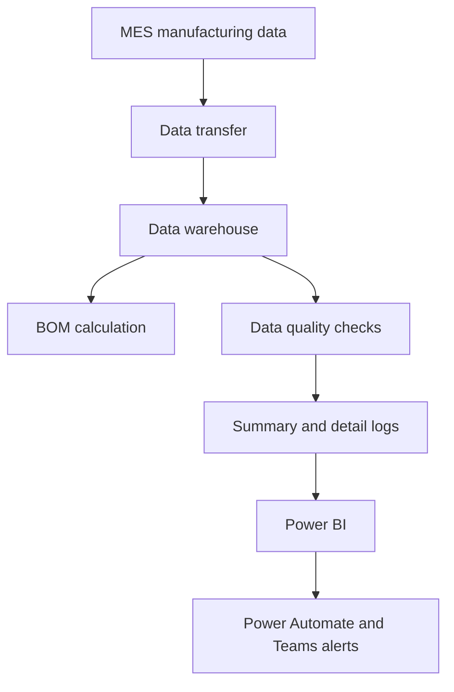

[繁體中文](README.md) | **English**

# Manufacturing Data Quality Monitoring Platform

Embedded data quality into daily bill of materials (BOM) operations through measurable, traceable monitoring and notification controls, reducing the impact of data exceptions on calculation results and downstream decisions. The platform checks **8 critical data tables** each day, presents quality status in Power BI, and sends exceptions to Teams through Power Automate. It detected an empty source table after go-live and is being phased out as BOM data access moves directly to MES.

## Project Overview

| Item | Description |
|---|---|
| Business domain | Manufacturing data quality and BOM reliability |
| My role | Rule design, application development, dashboard, notification workflow |
| Monitoring scope | 8 critical BOM data tables, checked daily |
| Go-live | July 2025 |
| Current status | Being phased out as BOM data access moves directly to MES |

## Business Challenge

BOM calculations previously read manufacturing data from a data warehouse populated through MES file transfers. Empty tables, schema changes, or delayed updates were often discovered only after BOM results appeared abnormal, making source-table diagnosis time-consuming.

## Approach

1. Identified the 8 critical BOM input tables and their expected update windows.
2. Defined rules for empty tables, required fields, null values, and data freshness.
3. Ran checks daily and stored both table-level summaries and rule-level details.
4. Presented current status and history in Power BI.
5. Sent exceptions through Power Automate to Teams for logistics, steelmaking, and related teams.

## Data Quality Rules

| Dimension | Check |
|---|---|
| Completeness | Table row count is greater than zero |
| Schema | Required fields exist |
| Field quality | Specified fields are not null |
| Freshness | Latest data falls within the expected time window |

Data sources, schedules, tables, and rule assignments are configuration-driven, allowing the monitoring scope to be adjusted without hard-coding each case.

## Architecture

See the [detailed system architecture](docs/architecture_en.md) for the validation workflow, log model, and phase-out design.

## My Contributions

- Defined monitoring scope, expected update windows, and quality rules.
- Developed the automated validation process and configuration structure.
- Built summary and detail logs covering batch, timestamp, rule, and exception evidence.
- Developed the Power BI dashboard and Teams notification workflow.
- Supported IT and business teams in locating and resolving exceptions.

The underlying data-transfer process was owned by IT. This project provided an independent monitoring and evidence layer.

## Incident Example

The platform detected a critical BOM input table with no records before calculation. The alert identified the table, failed rule, and check time, allowing the responsible teams to confirm and resolve the transfer issue through Teams.

## Key Outcomes

- Moved exception detection upstream, before BOM calculation.
- Monitors **8 critical data tables** for completeness and freshness each day.
- Established Power BI monitoring and proactive Teams notification.
- Preserved rule-level evidence to shorten diagnosis time.
- Detected and supported resolution of an empty-table incident.

## Phase-Out Plan

The platform was designed to control transfer risk between MES and the data warehouse. As BOM data access moves directly to MES, that intermediate risk is reduced. Monitoring will remain only where needed, while the remaining functions are retired in stages.

## Technology

Python, Great Expectations, YAML, SQL, relational databases, Power BI, Power Automate, and Teams.

## Confidentiality

This case study presents de-identified data quality rules and system architecture only. It excludes proprietary data, credentials, internal URLs, actual table names, connection details, and complete source code.
