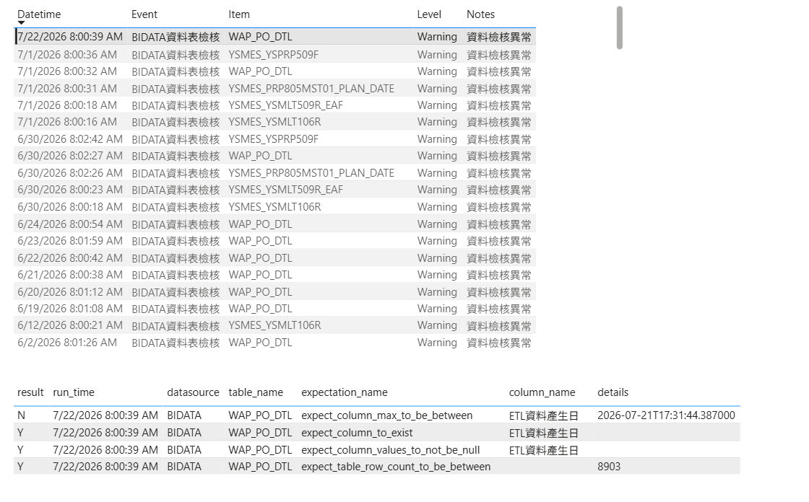
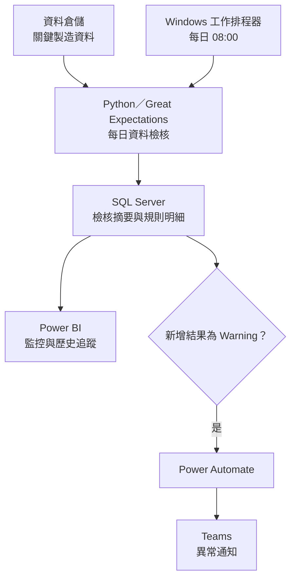

[English](README.md) | **繁體中文**

# 製造資料品質監控平台

為 [最低成本 BOM 資料與決策平台](https://github.com/ChienChienChien/BOM_Management_Platform/blob/main/README_ZH-TW.md) 與 [原料庫存推估與庫存告警系統](https://github.com/ChienChienChien/Material_Forecasting_System/blob/master/README_ZH-TW.md) 建立資料進入決策流程前的品質門檻。透過每日自動檢核、集中監控與異常通知，讓資料過期、缺漏或結構異常能在影響下游分析前被發現，提升決策所依賴資料的可信度。

## 目的

最低成本 BOM 與原料庫存推估所使用的製造資料，部分由大型作業系統每日轉檔至資料倉儲。來源系統負載、資料倉儲效能、資料庫鎖定或轉檔流程異常，都可能造成資料延遲、缺漏或不完整。

這類問題不一定會使程式執行失敗；有時流程看似正常，直到使用者發現報表結果與實務認知不符後才開始追查。若異常未及時發現，可能使 BOM 計算產生偏差，或讓原料庫存推估未能正確顯示缺料風險，進而錯失追料或調整生產計畫的時機。

本專案的目的，是在資料進入決策流程前建立基本可信門檻，主動辨識資料的時效性、完整性與基本結構異常，降低下游系統使用不可靠資料的風險。

## 成果

### 1. 將資料檢核前移至決策流程上游

在最低成本 BOM 與原料庫存推估讀取資料前，先對關鍵資料表執行一致的品質規則，讓下游系統使用的原始資料具備可追蹤的檢核依據。這項機制無法取代所有業務邏輯驗證，但為資料是否適合進入決策流程建立了明確門檻。

### 2. 從使用者回報轉為主動發現與通知

系統每天自動執行檢核；當 SQL Server 新增一筆 `Warning` 結果時，由 Power Automate 觸發 Teams 通知，讓報表使用者與維護人員能及早掌握異常。相較於等待報表結果出現落差後才回頭排查，這套流程能降低異常延遲發現的風險，並縮短發現與確認問題所需的時間。

### 3. 建立集中且可追溯的異常紀錄

Power BI 集中呈現檢核時間、資料表、異常狀態與規則明細，使維護人員能快速確認是哪一項檢核未通過，再依問題來源與 IT 或相關系統負責人協作處理。平台負責提早發現與定位，不直接修改或自動修復來源資料。

  

> Warning 範例：上方呈現異常歷史紀錄，下方保留單次檢核的規則結果與明細，協助快速確認異常來源。

## 作法

### 1. 定義決策資料的基本品質門檻

依資料在最低成本 BOM 與原料庫存推估中的用途，將檢核規則整理為三個面向：

| 檢核面向 | 檢核內容 | 管理目的 |
|---|---|---|
| 時效性 | 資料表是否於每日預期時間完成更新 | 避免下游系統使用過期資料 |
| 完整性 | 資料表是否為空、資料轉檔日期是否存在空值 | 辨識資料缺漏或轉檔不完整 |
| 基本結構 | 資料轉檔日期欄位是否存在 | 提前發現欄位異動造成的流程風險 |

### 2. 建立每日自動檢核流程

檢核程式部署於 Windows Server，並由 Windows 工作排程器於每天上午 8 點觸發。Python 透過 Great Expectations 執行規則，將每次檢核的整體狀態與規則明細寫入 SQL Server，保留後續追蹤所需的時間與異常證據。

### 3. 串接監控與異常處理

檢核完成後，Power BI 同步更新監控畫面；若 SQL Server 新增的檢核結果為 `Warning`，Power Automate 便發布 Teams 通知。維護人員依異常資料表與失敗規則進行確認，再視問題來源聯繫 IT 或相關系統負責人處理。

## 架構

這套架構將資料檢核、結果留存、視覺化與通知串成同一條監控流程。資料異常被識別後仍由維護人員判斷來源並協調處理，避免監控平台在未確認原因前直接變更原始資料。

## 技術

| 類別 | 技術 | 用途 |
|---|---|---|
| 檢核程式 | Python、Great Expectations | 執行資料時效性、完整性與基本結構規則 |
| 資料儲存 | SQL Server | 儲存檢核摘要、規則明細與歷史紀錄 |
| 視覺化 | Power BI | 集中呈現異常狀態與檢核結果 |
| 流程通知 | Power Automate、Microsoft Teams | 依 `Warning` 紀錄觸發並發布異常通知 |
| 執行環境 | Windows Server、Windows 工作排程器 | 每日自動執行檢核流程 |
