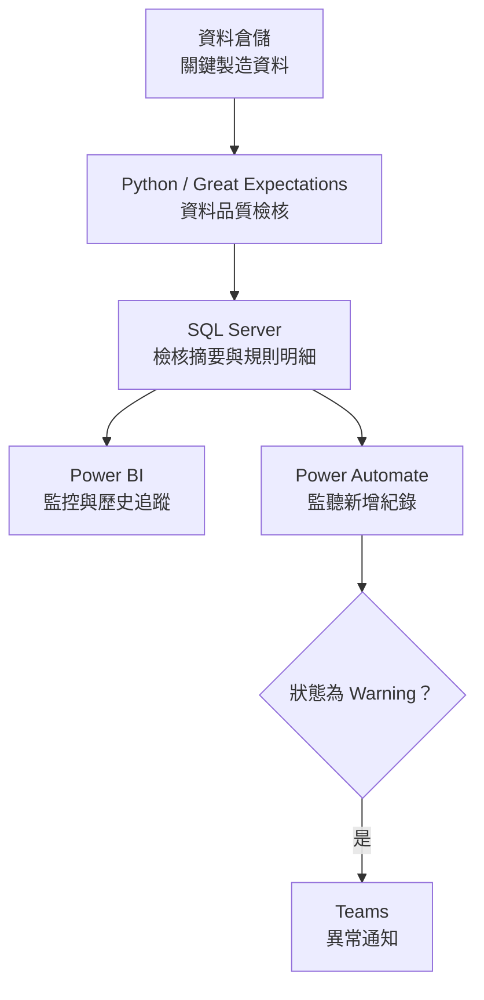

[English](README.md) | **繁體中文**

# 資料品質監控平台
資料倉儲（Data Warehouse）提供 [最低成本 BOM 資料與決策平台](https://github.com/ChienChienChien/BOM_Management_Platform/blob/main/README_ZH-TW.md) 與 [原料庫存推估與庫存告警系統](https://github.com/ChienChienChien/Material_Forecasting_System/blob/master/README_ZH-TW.md) 所需的資料，在資料進入決策流程前，建立可靠的資料品質門檻。

## 目的

資料倉儲（Data Warehouse）每日接收來自大型系統（例如MES, SAP）的資料，然而資料傳輸的過程中，容易發生以下問題導致資料延遲、缺漏或不完整：

- 來源系統與資料倉儲的效能問題
- 資料庫鎖定或查詢效能問題
- 來源系統的資料表規格修改
- 轉檔程式異常

本專案以監控的角度，透過每日自動檢核、集中監控與異常通知，讓資料過期、缺漏或結構異常能在影響下游分析運用前被發現，提升決策資料的可信度。

## 成果與作法

### 1. 建立決策資料的品質門檻

針對最低成本 BOM 與原料庫存推估所使用的關鍵資料，建立時效性、完整性與基本結構三類檢核規則，在資料進入決策流程前，先確認是否符合基本的使用條件。

| 檢核面向 | 檢核內容 | 管理目的 |
|---|---|---|
| 時效性 | 資料表是否於每日預期時間完成更新 | 避免下游系統使用過期資料 |
| 完整性 | 資料表是否為空、資料轉檔日期是否存在空值 | 辨識資料缺漏或轉檔不完整 |
| 基本結構 | 資料特定欄位是否存在 | 提前發現欄位異動造成的流程風險 |

此機制聚焦於資料時效性、完整性與基本結構，作為下游模型執行前的第一道品質檢核，降低最低成本 BOM、庫存推估與缺料判斷使用異常資料的風險。

### 2. 將資料檢核轉為每日自動化流程

檢核程式部署於 Windows Server，由 Windows 工作排程器於每天上午 8 點自動觸發。Python 使用 Great Expectations 執行資料品質檢核，將整體結果與各項規則明細寫入 SQL Server，並供 Power BI 更新監控畫面。

透過自動檢核與集中呈現，資料品質管理不再依賴人工逐一確認；維護人員可以從歷史紀錄快速掌握異常資料表、發生時間與未通過的規則，縮短問題確認與定位所需的時間。

### 3. 從使用者回報轉為主動異常通知

當 SQL Server 新增一筆狀態為 `Warning` 的檢核結果時，Power Automate 會自動將異常發布至 Teams，讓報表使用者與維護人員及早掌握問題。

維護人員可依異常資料表與失敗規則判斷可能來源，再聯繫 IT 或相關系統負責人處理。相較於過去等待使用者發現報表結果異常後才進行排查，這套流程將資料品質管理從被動回報轉為主動發現，降低異常資料持續影響下游分析與決策的風險。

<table>
  <tr>
    <td align="center" width="100%">
       
    </td>
  </tr>
</table>

> Warning 範例：上方呈現異常歷史紀錄，下方保留單次檢核的規則結果與明細，協助維護人員快速確認異常來源。

## 架構

## 技術

| 類別 | 技術 | 用途 |
|---|---|---|
| 檢核程式 | Python、Great Expectations | 執行資料時效性、完整性與基本結構規則 |
| 資料儲存 | SQL Server | 儲存檢核摘要、規則明細與歷史紀錄 |
| 視覺化 | Power BI | 集中呈現異常狀態與檢核結果 |
| 流程通知 | Power Automate、Microsoft Teams | 依 `Warning` 紀錄觸發並發布異常通知 |
| 執行環境 | Windows Server、Windows 工作排程器 | 每日自動執行檢核流程 |
