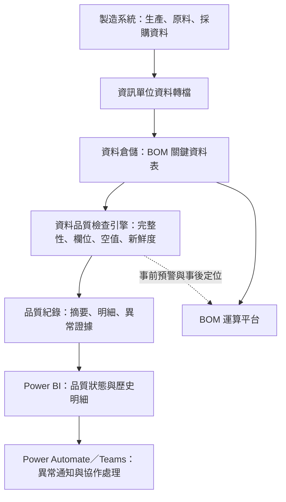
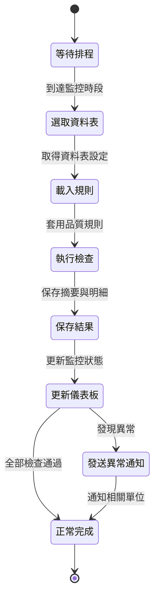
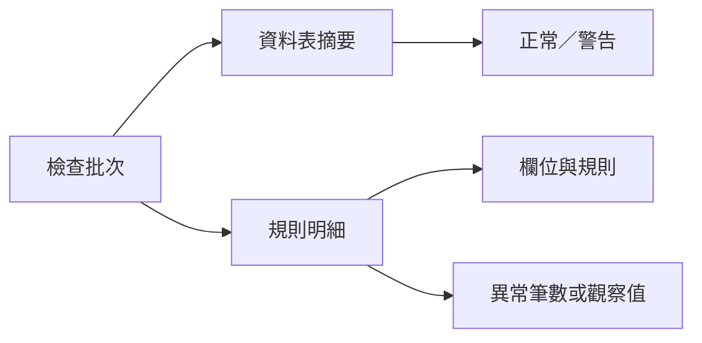
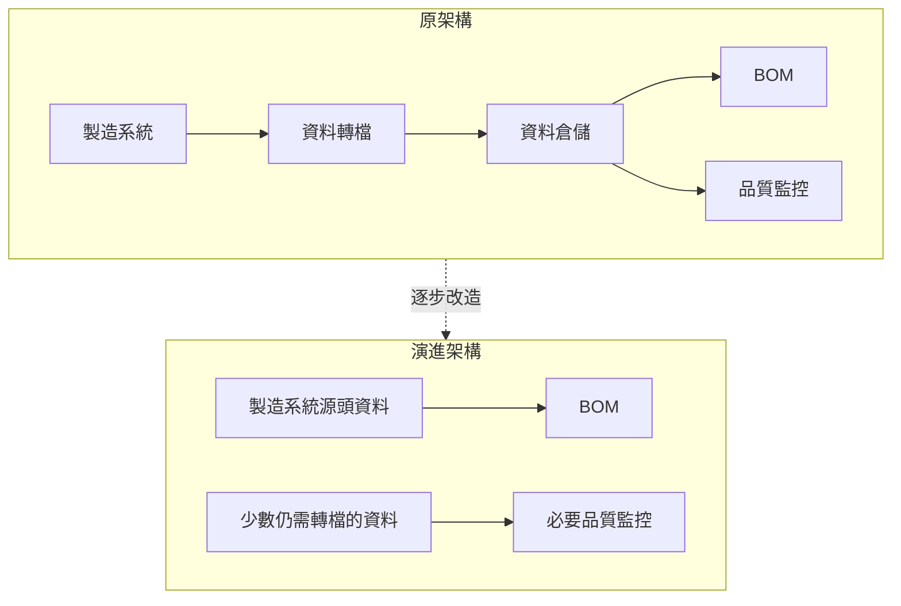

# 製造資料品質監控平台｜架構圖

## 上線期間架構

## 各層職責

| 層級 | 主要職責 |
|---|---|
| 製造系統 | 產生 BOM 所需的生產、原料及採購資料 |
| 資訊單位資料轉檔 | 將來源資料定期寫入資料倉儲 |
| 資料倉儲 | 提供 BOM 與其他分析系統使用的整合資料表 |
| 資料品質檢查引擎 | 依排程與設定檔執行表格及欄位規則 |
| 品質紀錄 | 保存資料表摘要與每項規則的明細結果 |
| Power BI | 集中呈現正常、警告、歷史與異常細節 |
| Power Automate／Teams | 將異常轉換成可被相關單位處理的通知 |
| BOM 運算平台 | 使用資料倉儲內容進行 BOM 計算 |

## 品質檢查流程

## 品質紀錄模型

摘要紀錄支援儀表板與通知；規則明細則保留問題定位需要的欄位、檢查類型、異常數量與實際值。

## 架構演進

平台逐步退場並不代表專案失敗，而是上游架構改善後，原本為轉檔風險建立的控制層已不再需要完整保留。

## 圖示說明

- 實線箭頭代表主要資料或流程方向。
- 虛線箭頭代表監控回饋或架構演進。
- 所有資料來源、資料表及系統名稱均已去識別化。

