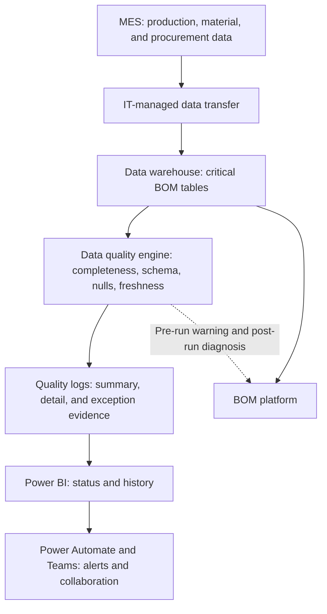
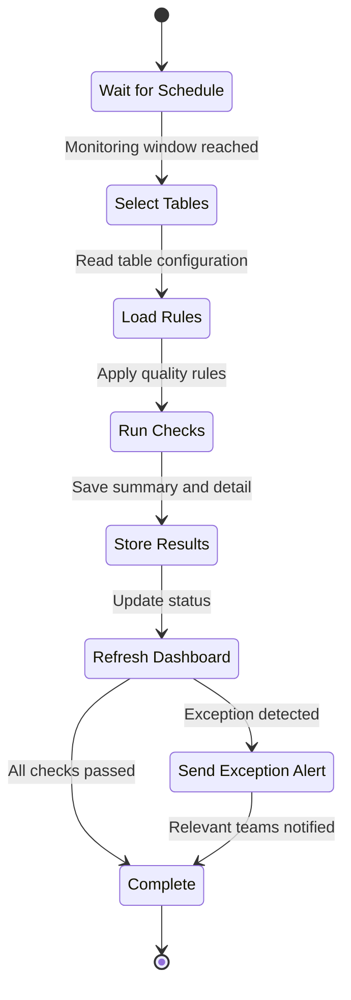
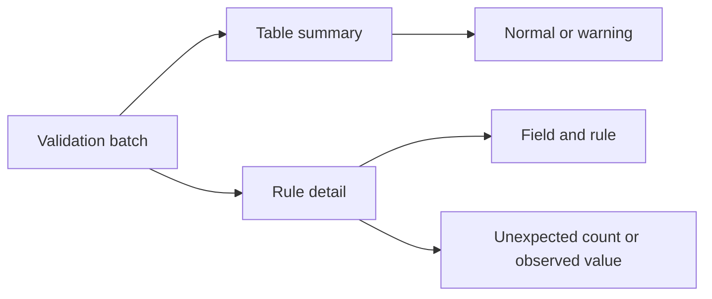
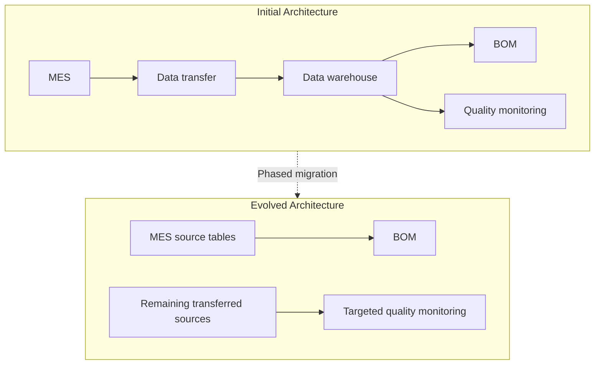

[繁體中文](architecture.md) | **English**

# Manufacturing Data Quality Monitoring | System Architecture

## Production Architecture

## Component Responsibilities

| Component | Responsibility |
|---|---|
| MES | Produces the production, material, and procurement data required by BOM |
| IT-managed data transfer | Loads source data into the data warehouse on schedule |
| Data warehouse | Provides integrated tables for BOM and other analytical use |
| Data quality engine | Applies table- and field-level rules based on schedule and configuration |
| Quality logs | Stores table summaries and detailed results for every rule |
| Power BI | Presents normal status, warnings, history, and exception details |
| Power Automate and Teams | Converts exceptions into notifications for the responsible teams |
| BOM platform | Uses the data warehouse tables for BOM calculation |

## Validation Workflow

## Quality Log Model

Summary records support dashboards and notifications. Rule-level detail preserves the field, validation type, exception count, and observed value required for diagnosis.

## Architecture Evolution

The platform is being phased out because direct MES access removes much of the transfer risk it was designed to control. Monitoring remains only for sources that still require an intermediate transfer.

## Diagram Notes

- Solid arrows indicate the primary data or process flow.
- Dashed arrows indicate monitoring feedback or architecture evolution.
- All data sources, tables, and system names are de-identified.
